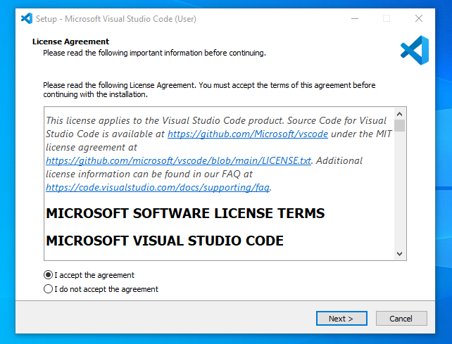
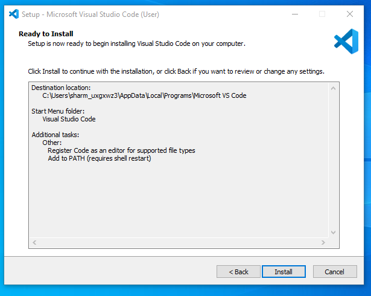
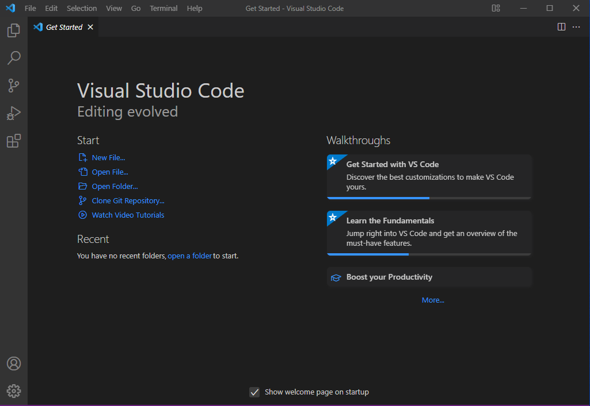

# SE-Assignment-5
Installation and Navigation of Visual Studio Code (VS Code)
 Instructions:
Answer the following questions based on your understanding of the installation and navigation of Visual Studio Code (VS Code). Provide detailed explanations and examples where appropriate.

 Questions:

1. Installation of VS Code:
   - Describe the steps to download and install Visual Studio Code on Windows 11 operating system. Include any prerequisites that might be needed.

- step 1 :Visit the VS Code Website:

https://code.visualstudio.com/.
Download the Installer:

- step 2 :Click on the "Download for Windows" button. This will download the VS Code installer (VSCodeSetup.exe).

- step 3: Run the Installer: This is done through locating the downloaded VSCodesetup.exe file and double clicking it to run the installer.

- step 4: Accept the License Agreement:
Read the license agreement and click on the "I accept the agreement" checkbox. Click "Next" to proceed.

- step 5: Select Installation Location:

Choose the destination folder where you want to install VS Code and Click "Next" to continue.

- step 6: Select Additional Tasks:

Choose additional tasks such as creating a desktop icon, adding VS Code to the PATH, and associating VS Code with supported file types. Click "Next".

- step 7: Install:
Click "Install" to begin the installation process.

- step 8: Finish the Installation:

Once the installation is complete, you can choose to launch Visual Studio Code immediately by selecting the checkbox and clicking "Finish".

- Step 9: After the previous step, the Visual Studio Code window opens successfully. 

2. First-time Setup:
   - After installing VS Code, what initial configurations and settings should be adjusted for an optimal coding environment? Mention any important settings or extensions.

1. Install Extensions:
- Go to the Extensions view by clicking the Extensions icon in the Activity Bar or by pressing Ctrl+Shift+X.
- Essential extensions for web development include:
- Prettier - Code formatter
- Live Server
- Debugger for Chrome
- Set Up Settings Sync:

2. Enable Settings Sync to keep your settings, extensions, and other preferences consistent across multiple devices.
3. Go to Settings > Turn on Settings Sync or use the Command Palette (Ctrl+Shift+P) and search for "Settings Sync".
- Configure Settings:

- Open Settings by pressing Ctrl+, or by navigating to File then Preferences then Settings.
Adjust common settings such as:
- Theme: Choose between Dark+ (default dark) or Light+ (default light).
- Font size: Modify Editor: Font Size to your preference.
- Auto Save: Enable auto-saving files by setting Files: Auto Save to afterDelay.

3. User Interface Overview:
   - Explain the main components of the VS Code user interface. Identify and describe the purpose of the Activity Bar, Side Bar, Editor Group, and Status Bar.
- Activity Bar:
  Located on the far left, it provides access to different views like Explorer, Search, Source Control, Run and Debug, and Extensions.

- Side Bar:
 Displays different views such as the File Explorer, Source Control, and Extensions. It helps in navigating through files and managing your project.

- Editor Group:
 The main area where you edit your code. You can split the editor into multiple groups to view and edit files side by side.

- Status Bar:
 Located at the bottom, it shows information about the current file, such as encoding, line endings, language mode, and errors. It also provides shortcuts to certain settings.

4. Command Palette:
   - What is the Command Palette in VS Code, and how can it be accessed? Provide examples of common tasks that can be performed using the Command Palette.
- Command Palette is a powerful interface element that allows users to perform actions more efficiently by typing commands.
- Accessing the Command Palette:
  Press Ctrl+Shift+P or F1 to open the Command Palette.

- Common Tasks:
 Changing the theme: Type "Theme" and select "Preferences: Color Theme".
 Installing extensions: Type "Extensions: Install Extensions".
 Running a task: Type "Run Task" and select the desired task.

5. Extensions in VS Code:
   - Discuss the role of extensions in VS Code. How can users find, install, and manage extensions? Provide examples of essential extensions for web development.

- Role of Extensions
- Extensions enhance the functionality of VS Code by adding new features, integrating tools, and improving workflows.
- Finding and Installing Extensions
- Access Extensions View:
- Click the Extensions icon in the Activity Bar or press Ctrl+Shift+X.

- Search and Install:
- Use the search bar to find extensions. Click the Install button next to the desired extension.

- Manage Extensions:
- Manage installed extensions from the Extensions view. You can disable, uninstall, or configure settings for each extension.

- Essential Extensions for Web Development
- ESLint: Linting JavaScript code.
- Prettier - Code formatter: Automatic code formatting.
- Live Server: Launch a local development server with live reload.
- Debugger for Chrome: Debug JavaScript code in Chrome.

6. Integrated Terminal:
   - Describe how to open and use the integrated terminal in VS Code. What are the advantages of using the integrated terminal compared to an external terminal?

- Open Terminal:

- Go to View > Terminal. or just click terminal at the top of Vs code

- Advantages:
- Conveniently run command-line tasks without leaving the editor.
- Integrates with the workspace, providing context-aware command execution.
- Supports multiple terminal instances and different shells (e.g., PowerShell, Command Prompt, Git Bash).

7. File and Folder Management:
   - Explain how to create, open, and manage files and folders in VS Code. How can users navigate between different files and directories efficiently?

- Creating, Opening, and Managing Files and Folders
- Create a New File/Folder:
Right-click in the Explorer view and select New File or New Folder.
- Open a File/Folder:
Use File > Open File or File > Open Folder, or drag and drop files/folders into the editor.
- Efficient Navigation:
Use Ctrl+P to quickly open files by typing their name.
Use Ctrl+Shift+E to focus on the Explorer view.

8. Settings and Preferences:
   - Where can users find and customize settings in VS Code? Provide examples of how to change the theme, font size, and keybindings.

- Customizing Settings
- Open Settings:
Press Ctrl+, or go to File > Preferences > Settings.
- Change Theme:
Navigate to Settings > Color Theme or use the Command Palette (Ctrl+Shift+P) and search for "Color Theme".
- Adjust Font Size:
Search for Editor: Font Size in Settings and adjust the value.
- Modify Keybindings:
Go to File > Preferences > Keyboard Shortcuts or press Ctrl+K Ctrl+S.

9. Debugging in VS Code:
   - Outline the steps to set up and start debugging a simple program in VS Code. What are some key debugging features available in VS Code?

- Setting Up and Starting Debugging
- Open Debug View:
Click the Run and Debug icon in the Activity Bar or press Ctrl+Shift+D.
- Configure Debugger:
Click create a launch.json file to configure debugging settings for your project.
- Set Breakpoints:
Click in the gutter next to the line numbers to set breakpoints.
- Start Debugging:
Press F5 to start debugging. Use the Debug toolbar to control the execution.
- Key Debugging Features
- Breakpoints: Pause code execution at specific lines.
- Watch: Monitor expressions or variables.
- Call Stack: View the call stack to trace function calls.
- Variables: Inspect variables in the current scope.

10. Using Source Control:
    - How can users integrate Git with VS Code for version control? Describe the process of initializing a repository, making commits, and pushing changes to GitHub.

- Initialize Repository:
Open the Source Control view by clicking the Source Control icon or pressing Ctrl+Shift+G.
Click Initialize Repository.
- Making Commits:
Stage changes by clicking the + icon next to the files.
Enter a commit message and click the checkmark icon to commit.
- Pushing Changes to GitHub:
Set up a remote repository by using the Command Palette (Ctrl+Shift+P) and typing Git: Add Remote.
Enter the remote URL.
- Push changes by clicking the ellipsis (...) in the Source Control view and selecting Push.

 Submission Guidelines:
- Your answers should be well-structured, concise, and to the point.
- Provide screenshots or step-by-step instructions where applicable.
- Cite any references or sources you use in your answers.
- Submit your completed assignment by 1st July 

